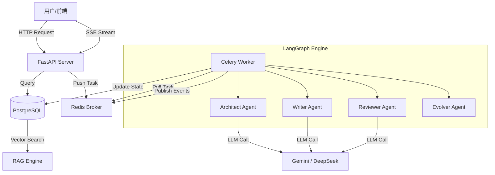

# NovelGen-Enterprise (NGE) 🚀

[](https://www.python.org/)
[](LICENSE)
[]()
[]()

**NovelGen-Enterprise (NGE)** 是一款企业级、高可用的长篇小说生成系统。它不仅仅是一个简单的 LLM 包装器，而是一个基于 **LangGraph** 的复杂多智能体协作系统，旨在解决长篇生成中的逻辑连贯性、人物一致性和风格统一性问题。

系统采用 **DeepSeek (逻辑中枢)** 与 **Gemini (文学工匠)** 的双模型架构，结合 **Celery + Redis** 分布式任务队列和 **PostgreSQL (pgvector)** 向量数据库，支持多用户、多项目、多分支的高并发生成。

---

## 📋 目录

- [核心特性](#-核心特性)
- [系统架构](#-系统架构)
- [快速开始](#-快速开始)
  - [前置要求](#前置要求)
  - [方式一：Docker 一键部署（推荐）](#方式一docker-一键部署推荐)
  - [方式二：本地开发环境搭建](#方式二本地开发环境搭建)
- [数据库初始化](#-数据库初始化)
- [数据初始化](#-数据初始化)
  - [导入小说设定](#1-导入小说设定)
  - [导入资料库](#2-导入资料库)
- [配置说明](#-配置说明)
- [使用指南](#-使用指南)
  - [命令行工具 (CLI)](#1-命令行工具-cli)
  - [API 接口](#2-api-接口)
  - [Web 界面](#3-web-界面)
- [项目结构](#-项目结构)
- [常见问题](#-常见问题)
- [开发指南](#-开发指南)
- [贡献指南](#-贡献指南)
- [许可证](#-许可证)

---

## ✨ 核心特性

### 🧠 深度智能架构
- **双模型协同**: DeepSeek 负责大纲拆解、逻辑审查和剧情推演；Gemini 负责正文撰写、文风模仿和长文本扩写。
- **LangGraph 状态机**: 摒弃简单的线性 Chain，采用循环图结构 (Cyclic Graph)，实现 Plan -> Write -> Review -> Revise 的自我修正循环。
- **RAG 上下文增强**: 基于 pgvector 的语义检索，精准提取与当前场景相关的世界观设定和历史伏笔。支持**小说专属资料库**与**全局资料库**的分级检索。
- **Antigravity Rules**: 内置反重力规则系统，防止人物 OOC、逻辑硬伤和世界观崩坏。

### ⚡ 企业级工程能力
- **分布式任务队列**: 集成 **Celery + Redis**，支持任务持久化、削峰填谷和异步处理，彻底解决长文本生成时的超时和任务丢失问题。
- **实时流式输出 (SSE)**: 支持 Server-Sent Events 协议，实时推送生成过程中的 Token 流和状态变更，提供类似 ChatGPT 的打字机体验。
- **多线剧情分支 (Multi-Branch)**: 支持平行宇宙（IF 线）生成。系统自动维护不同分支的人物状态快照，确保在切换分支时，人物的心情、技能和关系能够正确回溯。
- **全链路可观测**: 详细的日志记录和状态监控，随时掌握每个 Agent 的决策过程。

### 🛠 完善的配套设施
- **RESTful API**: 基于 FastAPI 构建的标准接口，支持 Swagger 文档。业务逻辑下沉至 Service 层，确保 API 与 CLI 行为一致。
- **可视化 Dashboard**: 提供基于 Vue.js 的管理界面，支持小说管理、大纲编辑、章节预览和生成控制。
- **Docker 化部署**: 提供完整的 Docker Compose 配置，一键拉起所有服务。
- **经典资料库**: 内置修真、赛博朋克、克苏鲁等经典网文设定库，支持 RAG 检索，辅助设定审查与大纲生成。

---

## 🏗 系统架构



---

## 🚀 快速开始

### 前置要求

#### Docker 部署（推荐）
- **Docker** 20.10+
- **Docker Compose** 2.0+
- **至少 4GB 可用内存**

#### 本地开发环境
- **Python** 3.10+
- **PostgreSQL** 16+ (需安装 pgvector 扩展)
- **Redis** 7+
- **Git**

### 方式一：Docker 一键部署（推荐）

```bash
git clone https://github.com/your-org/NovelGen-Enterprise.git
cd NovelGen-Enterprise
docker-compose up -d
```

### 方式二：本地开发环境搭建

1.  **创建虚拟环境**:
    ```bash
    python -m venv venv
    source venv/bin/activate  # Windows: venv\Scripts\activate
    ```
2.  **安装依赖**:
    ```bash
    pip install -r requirements.txt
    ```
3.  **配置环境变量**:
    复制 `.env.example` 到 `.env` 并填入 Key。
4.  **启动服务**:
    ```bash
    uvicorn src.main:app --reload
    celery -A src.worker worker --loglevel=info
    ```

---

## 📂 资料库管理

使用统一的 CLI 工具管理参考资料：

```bash
# 导入全局资料库
python -m src.scripts.manage_references import data/global_references.json

# 为特定小说导入资料库
python -m src.scripts.manage_references import data/novel_1_refs.json --novel-id 1

# 覆盖更新
python -m src.scripts.manage_references import data/refs.json --force
```

更多详情请参考 [REFERENCE_LIBRARY_GUIDE.md](REFERENCE_LIBRARY_GUIDE.md)

---

## 📝 开发指南

### 代码结构
- `src/agents/`: Agent 实现 (Writer, Reviewer, etc.)，均继承自 `BaseAgent`。
- `src/nodes/`: LangGraph 节点实现，解耦工作流逻辑。
- `src/services/`: 业务逻辑层，封装数据库与任务队列操作。
- `src/api/`: FastAPI 路由定义，调用 Service 层。
- `src/db/`: 数据库模型与 VectorStore。

### 验证与测试
运行优化验证脚本：
```bash
python src/scripts/verify_optimization.py
```
